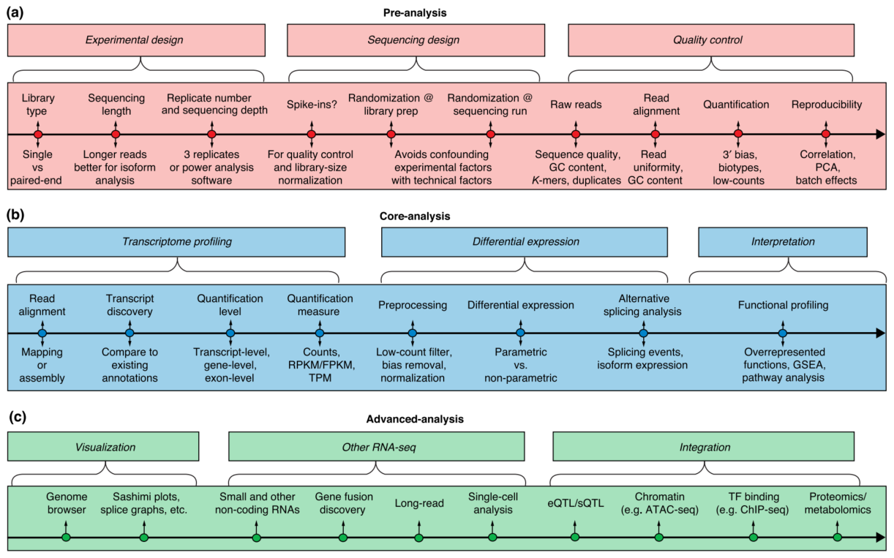

### **Introduction**
***[Snakemake](https://snakemake.readthedocs.io/en/stable/index.html) is a python-based pipeline software that can be used to automate the workflow of bioinformatics analysis. In this chapter, we will use snakemake to build a RNA-seq analysis pipeline.***

***
### **Installation**
  - **Install Miniconda**
    - Download the Miniconda installer for Linux from [here](https://docs.conda.io/en/latest/miniconda.html)
    - Run the installer
    - Add the following line to your .bashrc file
    ```bash
    export PATH="/home/username/miniconda3/bin:$PATH"
    ```
    - Run the following command to update conda
    ```bash
    conda update conda
    ```
  - **Install Snakemake**
    ```
    conda install -c bioconda -c conda-forge snakemake
    ```
***
### **Pipeline**
  - **Quality Control**
    - **FastQC**
      - **Input**: Fastq files
      - **Output**: FastQC report
      - **Command**
      ```bash
      fastqc -o {output} {input}
      ```
      ```snakemake
      rule fastqc:
          input:
              "data/{sample}_1.fastq.gz",
              "data/{sample}_2.fastq.gz"
          output:
              "results/fastqc/{sample}_1_fastqc.html",
              "results/fastqc/{sample}_2_fastqc.html"
          shell:
              "fastqc -o {output} {input}"
      ```
    - **MultiQC**
      - **Input**: FastQC report
      - **Output**: MultiQC report
      - **Command**
      ```bash
      multiqc -o {output} {input}
      ```
      ```snakemake
      rule multiqc:
          input:
              "results/fastqc/{sample}_1_fastqc.html",
              "results/fastqc/{sample}_2_fastqc.html"
          output:
              "results/multiqc/multiqc_report.html"
          shell:
              "multiqc -o {output} {input}"
      ```
    - **Trimming**
      - **Input**: Fastq files
      - **Output**: Trimmed fastq files
      - **Command**
      ```bash
      java -jar <Path to trimmomatic.jar> --PE --threads -o {input} {output}
      ```
      ```snakemake
      rule trimmomatic:
          input:
              "data/{sample}_1.fastq.gz",
              "data/{sample}_2.fastq.gz"
          output:
              "results/trimmomatic/{sample}_1_paired.fastq.gz",
              "results/trimmomatic/{sample}_1_unpaired.fastq.gz",
              "results/trimmomatic/{sample}_2_paired.fastq.gz",
              "results/trimmomatic/{sample}_2_unpaired.fastq.gz"
          shell:
              "java -jar <Path to trimmomatic.jar> --PE --threads -o {input} {output}"
      ```
- **Alignment**
  ***There are many aligners that can be used for RNA-seq data. [bwa-mem2](https://github.com/bwa-mem2/bwa-mem2), [bowtie2](https://bowtie-bio.sourceforge.net/bowtie2/index.shtml), [hisat2](http://daehwankimlab.github.io/hisat2/), [STAR](https://github.com/alexdobin/STAR),[TopHat2](https://ccb.jhu.edu/software/tophat/index.shtml), etc. In this tutorial, we will use Hisat2 aligner.***
  - **Hisat2 genome reference index**
    - **Input**: Genome reference file
    - **Output**: Hisat2 genome reference index
    - **Command**
    ```bash
    hisat2-build -f {input} {output}
    ```
    ```snakemake
    rule hisat2_index:
        input:
            "data/genome.fa"
        output:
            "results/hisat2_index/genome.1.ht2",
            "results/hisat2_index/genome.2.ht2",
            "results/hisat2_index/genome.3.ht2",
            "results/hisat2_index/genome.4.ht2",
            "results/hisat2_index/genome.5.ht2",
            "results/hisat2_index/genome.6.ht2",
            "results/hisat2_index/genome.7.ht2",
            "results/hisat2_index/genome.8.ht2"
        shell:
            "hisat2-build -f {input} {output}"
    ```
    #### ***you can also download the index in the [website](https://daehwankimlab.github.io/hisat2/download/)***
    ```bash
  - **Hisat2 alignment**
    - **Input**: Trimmed fastq files
    - **Output**: BAM files
    - **Command**
    ```bash
    hisat2 -x <Path to reference genome> -1 {input} -2 {input} -S {output}
    ```
    ```snakemake
    rule hisat2:
        input:
            "results/trimmomatic/{sample}_1_paired.fastq.gz",
            "results/trimmomatic/{sample}_2_paired.fastq.gz"
        output:
            "results/hisat2/{sample}.bam"
        shell:
            "hisat2 -x <Path to reference genome> -1 {input} -2 {input} -S {output}"
    ```
  - **Samtools sort**
    - **Input**: BAM files
    - **Output**: Sorted BAM files
    - **Command**
    ```bash
    samtools sort -o {output} {input}
    ```
    ```snakemake
    rule samtools_sort:
        input:
            "results/hisat2/{sample}.bam"
        output:
            "results/samtools_sort/{sample}.sorted.bam"
        shell:
            "samtools sort -o {output} {input}"
    ``` 
  - **Featurecounts**
    - **Input**: All sorted BAM files
    - **Output**: Featurecounts report
    - **Command**
    ```bash
    featureCounts -T 20 -p -t exon -g gene_id -a <Path to annotation file> -o {output} {inputs}
    ```
    ```snakemake
    rule featurecounts:
        input:
            expand("results/samtools_sort/{sample}.sorted.bam", sample=SAMPLES)
        output:
            "results/featurecounts/featurecounts_report.txt"
        shell:
            "featureCounts -T 20 -p -t exon -g gene_id -a <Path to annotation file> -o {output} {inputs}"
    ```
  - **Differential expression analysis**
    - **Input**: Featurecounts report
    - **Output**: Differential expression analysis report
    - **Command**
    ```bash
    Rscript <Path to DESeq2.R> {input} {output}
    ```
    ```snakemake
    rule DESeq2:
        input:
            "results/featurecounts/featurecounts_report.txt"
        output:
            "results/DESeq2/DESeq2_report.txt"
        shell:
            "Rscript <Path to DESeq2.R> {input} {output}"
    ```
#### ***You can make a Rscript, Deseq2.R, from [Deseq2 tutorial](http://bioconductor.org/packages/devel/bioc/vignettes/DESeq2/inst/doc/DESeq2.html) and run it in the terminal.***
  - **GO and GSEA**
    - **Input**: Differential expression analysis report
    - **Output**: GO and GSEA report
    - **Command**
    ```bash
    Rscript <Path to GO_GSEA.R> {input} {output}
    ```
    ```snakemake
    rule GO_GSEA:
        input:
            "results/DESeq2/DESeq2_report.txt"
        output:
            "results/GO_GSEA/GO_report.txt",
            "results/GO_GSEA/GSEA_report.txt"
        shell:
            "Rscript <Path to GO_GSEA.R> {input} {output}"
    ```
####  ***You can make a Rscript, GO_GSEA.R, from [clusterProfile tutorial](https://github.com/YuLab-SMU/clusterProfiler) and run it in the terminal.***


***
**1. Conesa, Ana, et al. "A survey of best practices for RNA-seq data analysis." Genome biology 17.1 (2016): 1-19.**