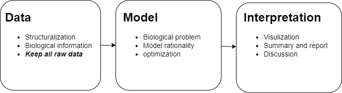

## **Cores for bioinformattrue**
 

### ***Coding + Statistcs + Biology***

- **Coding** : Linux, Python, R, Perl, Shell, C++, Java, etc.
- **Statistcs** : Theory of probability, Statistics inference, Machine learning, etc.
- **Biology** : ***Principle of Neural Science***, ***Gene XI***, ***Molecular Biology of the Cell 6th***, etc.

 

## **Data analysis**
- **Data preprocessing and managment**
- **Data transformation and operation**
- **Mathematical model**
- **Data visualization**
- **Data summary**
***

## Books
### ***Coding***
- [*C++ Primer*](https://book.douban.com/subject/25708312/)
- [*Python Crash Course*](https://book.douban.com/subject/35196328/)
- [*Fluent Python*](https://book.douban.com/subject/27028517/)
- [*Mr.Bird Linux*](https://book.douban.com/subject/4889838/)
### ***Statistics***
- [*All of Statistics*](https://book.douban.com/subject/2285151/)
- [*Statistical inference*](https://book.douban.com/subject/1464795/)
- [*Machine learning: A probabilistic Perspective*](https://book.douban.com/subject/10758624/)
- [*Deep Learning*](https://book.douban.com/subject/26883982/)
### ***Biology***
- [*Genes IX*](https://book.douban.com/subject/2058468/)
- [*Molecular biology of the cell*](https://book.douban.com/subject/2854616/)
- [*Principle of Neurobiology*](https://book.douban.com/subject/30356304/)
- [*Principle of Neural Science*](https://book.douban.com/subject/25723403/)
